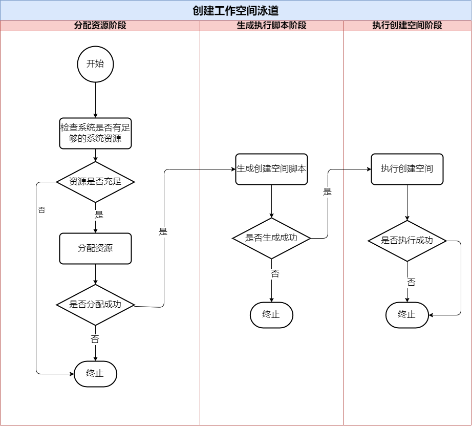
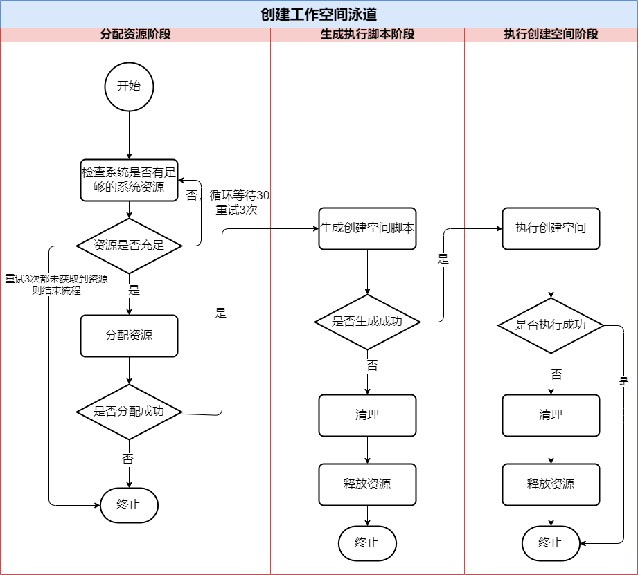
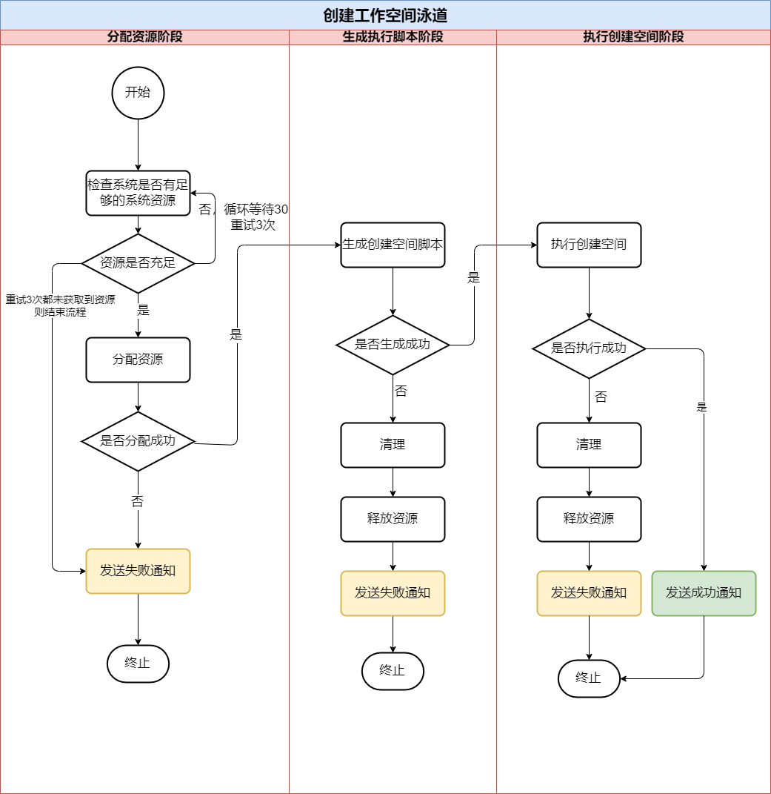

## 业务场景介绍

### 案例：【云工作空间项目】创建工作空间业务流程

#### 业务设计阶段1：业务初期的基本流程：

这个是业务初期设计的版本流程，我们定义为`版本v1`。

从上图看，分为三个过程：`分配系统资源`、`生成脚本`、`执行脚本`。 

**产品经理**分析后，认为这个流程没有考虑到每个`过程`可能出现`失败`情况，要求添加每个过程是否成功执行，再进行下个过程。

遂进行了第二次业务流程调整。

#### 业务设计阶段2：增加每个过程的执行结果的判断

**产品经理**将三个过程划分为三个阶段：`分配资源阶段`、`生成脚本阶段`、`执行脚本阶段`。

对每个阶段再进行细化：

1. **分配资源阶段**：
    - 首先检查系统资源是否充足，如果充足，则进行分配资源；如果不充足，则结束当前流程
    - 分配系统资源，如果分配成功则进行下一个阶段，如果不成功则结束流程

2. **生成脚本阶段**：
    - 生成创建工作空间脚本，如果生成成功，则进行下个阶段；如果生成失败，则结束流程

2. **执行脚本阶段**：
    - 执行脚本，如果执行成功，则完成结束；如果执行失败，则结束流程

接着，**产品经理**将此方案与**架构师**进行沟通评审，**架构师**提出几个问题：

1. `分配资源阶段`，系统资源是变化的，考虑一定的并发性，可以考虑增加重试机制，提升功能的鲁棒性，如分配失败后等待30s时间重试，循环3次；
2. `生成脚本阶段`、`执行脚本阶段`在执行不成功后，流程不光要终止，还需要**释放已经分配的系统资源**和**清理产生的临时文件和删除错误的数据**，失败后增加一个`清理`、`回滚`的操作；

**架构师**还考虑到技术实现方面注意点：
1. 各个阶段和过程应该用一些`状态`来管理和跟踪；
2. 每个过程都要相应增加`日志`记录，在上线后方便运维和研发排查定位问题；
3. 各个过程可能存在`超时`的情况：执行时间过长，导致流程阻塞。

**产品经理**接受了架构师的建议，进行了第三次的业务流程修改。

#### 业务设计阶段3：增加重试机制、清理、释放资源的操作

1. `分配资源阶段`，增加了重试机制
2. `生成脚本阶段`、`执行脚本阶段`，增加了失败清理和释放资源的过程

**产品经理**将该方案与用户代表、运维、运营人员等做了沟通，听取多方的建议。

大家提出了几个建议：

1. `流程的透明性`：创建流程都是后台处理，对用户来说是`黑盒`，如果创建失败，用户不清楚为何失败，希望能够给用户一个清晰反馈，并指导用户如何解决；
2. `故障的通知`：创建失败后，能够自动发送邮件、短信、站内信等通知，运营人员收到故障告警后，可以尽快响应和协调解决问题；
3. `排查问题效率`：运维人员希望通过友好的界面快速定位到`流程节点`，查看日志和参数，以便快速分析问题原因

**产品经理**将流程改了第4版

#### 业务设计阶段4：增加了通知机制

## 结尾

经过多轮业务设计，基本确定了“最终”的业务流程，然后交由研发人员开发进行技术实现；

创建工作空间的业务流程从最初设计，到不断融入新的需求，流程变的越来越复杂；

**产品经理**还有如`流程的透明性`、`排查问题效率`作为待办的事项，再后面产品设计时进行需要考虑，这里面涉及到功能性和非功能性的需求点，遂去找**架构师**看看是否从架构上进行支持

**架构师**梳理了需要解决的一些问题：

1. 流程中各个`状态`如何管理？
2. 流程中遇到执行失败，如何统一的异常处理和回滚机制？
3. 流程的`阶段`或`过程`遇到流程`阻塞`、`超时`，如何处理？
4. `流程的透明性`和`排查问题效率`：如何可视化各个流程的节点、日志、各个过程的输入参数和结果？

一番研究后，这些基本满足可以考虑使用`工作流`架构来处理这个业务流程。

*后续：见下篇《工作流BPMN2.0来表达复杂的业务流程》*

