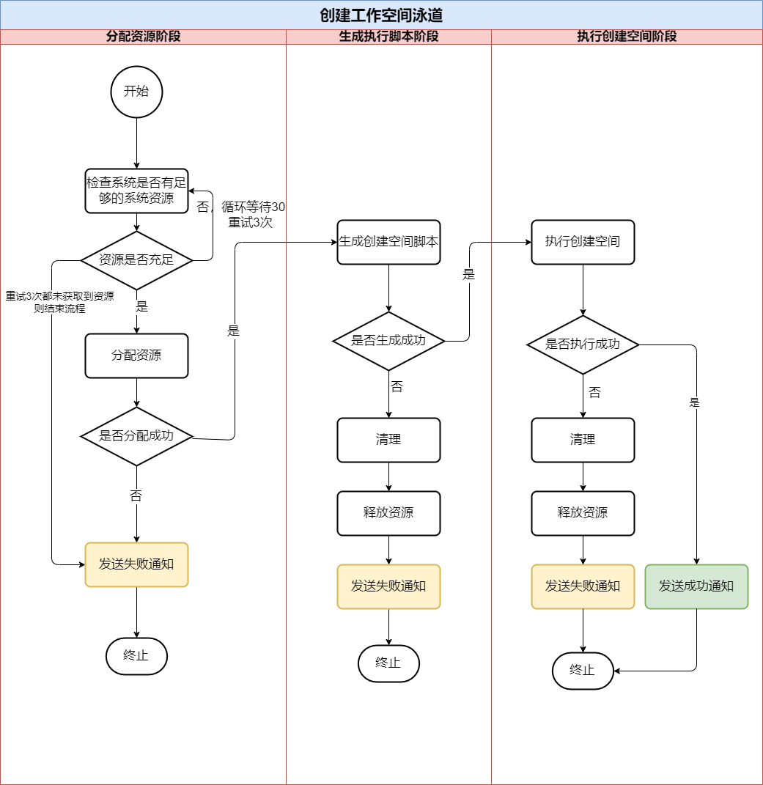
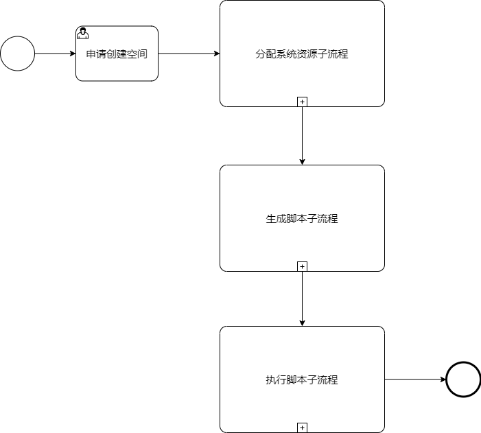

## 【云工作空间项目】创建工作空间业务流程案例分析

**产品经理**经过多轮业务设计和需求分析，得到“最终”业务流程：

从一步步推动更新版本，业务流程从最初设计，到不断融入新的需求，流程变的越来越复杂；

这里面涉及到功能性和非功能性的需求点，**产品经理**遂去找**架构师**看看是否从架构上进行支持，

**架构师**梳理了需要解决的一些问题：

1. 流程中各个`状态`如何管理？
2. 流程中遇到执行失败，如何统一的异常处理和回滚机制？
3. 流程的`阶段`或`过程`遇到流程`阻塞`、`超时`，如何处理？
4. `流程的透明性`和`排查问题效率`：如何可视化各个流程的节点、日志、各个过程的输入参数和结果？

一番研究后，这些基本满足可以考虑使用`工作流`架构来处理这个业务流程。

## BPMN2.0 工作流设计图

**架构师**使用`BPMN2.0`工作流设计工具，设计出如下图：

1. `申请创建空间`任务，当用户发起创建任务请求后，任务开始
2. `分配系统资源子流程`任务，对应的业务流程的中`分配系统资源阶段`
3. `生成脚本子流程`任务，对应的业务流程的中`生成脚本阶段`
4. `执行脚本子流程`任务，对应的业务流程的中`执行脚本阶段`

接着，**架构师**细化各个子流程。

### 细化分配系统资源工作流

关于流程说明：

1. `申请创建空间`任务，流程处理后，将进入`分配系统资源子流程`，并且开始`分配系统资源`任务；
2. `分配系统资源`任务成功后，子流程结束，流转到下个子流程`生成脚本`任务；
3. `分配系统资源`任务失败后，定时器循环3次，每次间隔30s，重新发起`分配系统资源`任务；
4. `分配系统资源`任务，若接收`取消`信号，流程进行`取消处理`的服务任务，该服务任务结束**流程终止**；
5. `分配系统资源子流程`，设置了超时时间，超时子流程没有结束，流程进行`超时处理`的服务任务，该任务会**发送通知（邮件、短信、站内信等）**，该服务任务结束**流程终止**；
6. `申请创建空间`任务，同理也做了超时处理。

### 细化生成脚本工作流

1. `分配系统资源`子流程成功后，开始发起`生成脚本`任务
2. `生成脚本`任务成功后，子流程结束，流转到下个子流程`执行脚本`任务；
3. `生成脚本`任务失败后，调用`失败处理`服务任务，该服务任务会**释放系统资源**、**清理生成文件**、**发送通知**，该服务任务结束**流程终止**；
4. `生成脚本子流程`，设置了超时时间，超时子流程没有结束，流程进行`超时处理`的服务任务，该任务会**发送通知**，该服务任务结束**流程终止**；

### 细化执行脚本工作流

1. `生成脚本`子流程成功后，开始发起`执行脚本`任务
2. `执行脚本`任务成功后，子流程结束，**整个流程结束**；
3. `执行脚本`任务失败后，调用`失败处理`服务任务，该服务任务会**释放系统资源**、**清理执行过程数据**、**发送通知**，该服务任务结束**流程终止**；
4. `执行脚本子流程`，设置了超时时间，超时子流程没有结束，流程进行`超时处理`的服务任务，该任务会**发送通知**，该服务任务结束**流程终止**；

### 展开完整的工作流

### 流程监控

采用`Activiti`、`Camunda`等主流的工作流技术框架，前端使用`Bpmn.js`，**高亮**出各个任务节点，可以方便的进行流程的监控

以此，实现`流程的透明性`，以及提升`排查问题效率`。

见下图是一个创建成功的演示示例：

## 结尾

最后我们来回答开始提出的问题是否得以解决

1. 流程中各个`状态`如何管理？

> 每个流程的任务，都可以视为一种状态，任务**待执行**、**执行中**、**任务完成**，通过当前正在执行的任务节点，得到当前最新的状态。

2. 流程中遇到执行失败，如何统一的异常处理和回滚机制？

> 从流程设计上来看，使用**失败处理**、**超时处理**等服务任务，可以在发生失败结果的时候统一处理，并且可以自行进行释放资源等一系列的回滚操作。

3. 流程的`阶段`或`过程`遇到流程`阻塞`、`超时`，如何处理？

如设计图所示，可以看到为**任务**、**子流程**设置超时时间，并且流程超时后的回调**超时处理**服务任务，以此防止流程阻塞。

4. `流程的透明性`和`排查问题效率`：如何可视化各个流程的节点、日志、各个过程的输入参数和结果？

> 这个涉及到技术实现，我们可以采用Activiti、Camunda等主流的工作流技术框架，可以将流程可视化，通过历史流程任务的高亮机制，快速定位到当前任务。工作流框架的允许开发时记录业务信息、业务参数、结果等其他数据，通过将历史信息查询出来，可以非常方便的进行问题定位和排查。

*后续：将讨论使用基于工作流的自动作业的技术方案。*