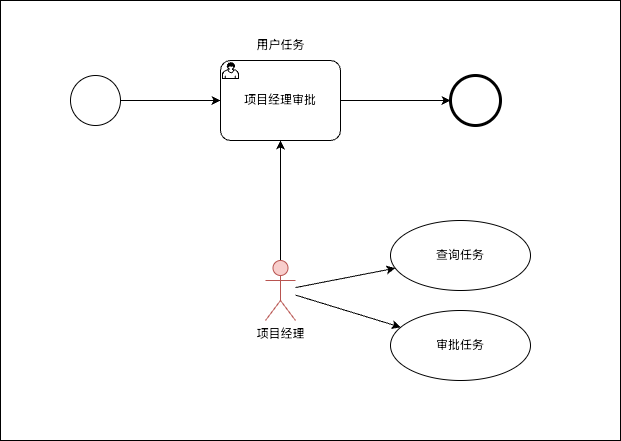
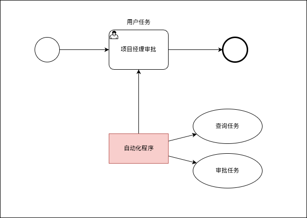
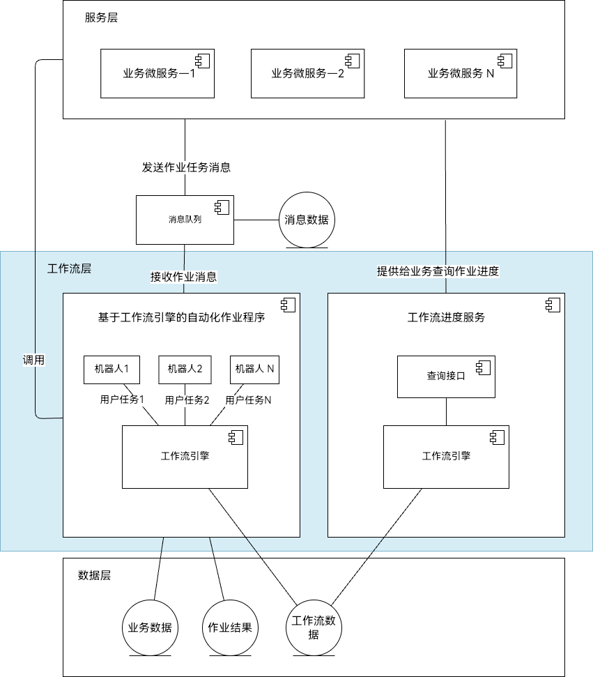
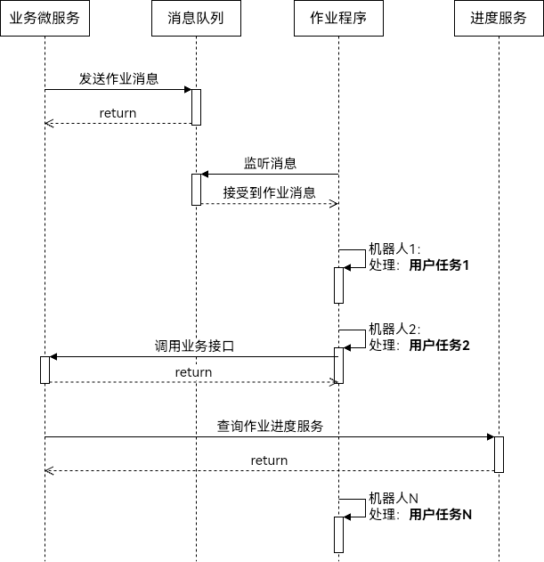

上篇，我们了解到工作流BPMN2.0设计，可以非常方便的表达非常复杂的流程。
当前工作流大部分的使用场景基本都是面向企业的OA系统，工作流中`任务`一般是`人`来处理，而我们需要将工作流中定义好的任务，让系统可以`自动拾取`，`自动完成`任务，而我们用户、研发、运营人员只需去看它运行的各个流程任务的完成情况就可以了。

当然，工作流自动处理可以是`全自动`，也可以是`半自动`，`全自动`是完全由程序运行，不需要`人`参与；`半自动`即在到达一个任务时或者出错时，流程流转到人工处理，人工干预等。这样，全自动和半自动的结合可以通过流程活动来监管整个业务的生命周期。

接下来由我来设计一个技术方案和架构，来实现一个基于工作流的自动化作业方案。

## 现实世界的工作流场景

举一个简单的示例：

公司设计了一套流程：项目经理负责去审批一些团队员工发起的任务，这里简化画了一个图：

我们可以看到，项目经理先去`查询待审批的任务`，如果查到任务，则进行`审批任务`。

由于项目经理是程序员出身，觉得某些任务完全可以自动化处理，如自动判断是否符合条件，自动完成审批，于是写了一个`自动化程序`来代替自己工作，以此来提高工作效率。

如上图所示，`自动化程序`不断循环`查询`待审批的任务，如果查询到任务，则进行`审批任务`。

## 自动化作业的可行性

可以看出，`自动化程序` 基本等价 `项目经理`，也就是说`自动化程序`完成了相当于`人`得工作，我们把`自动程序`叫做`机器人`可谓是非常贴切！

我们也可以看出，工作流中的`用户任务`的处理，可以让`机器人`来完成；

如果工作流中有多个`用户任务`，我们可以去定义多个`机器人`进行工作。

因此，**通过工作流的自动作业是`完全可行`的**。

## 基于工作流自动化作业的逻辑架构设计

接下来，我们来设计一个较简单的逻辑架构，来支撑基于工作流的自动化作业场景，如图所示：

架构说明：

1. 架构分为：服务层、工作流层、数据层
2. 服务层：主要由业务微服务组成，支撑业务的功能，服务层接收到用户`发起`的作业，并发送消息到消息队列
3. 工作流层：包含工作流的`自动化作业程序`，工作流的`进度查询服务`
4. 数据层：存储业务数据、作业处理结果、工作流引擎数据

- 系统调用流程
	- 自动化作业程序接收`消息`，开始启动发起工作流实例
    - 作业程序中，根据工作流实例的用户任务，启动各个需要处理`用户任务`的`机器人`，`机器人`不断循环查询各自负责的`用户任务`。比如，某个`用户任务`的`机器人`处理完成后，工作流引擎会自动流转，其他相应的`用户任务`的`机器人`就会开始处理，如此流程自动化完成
    - 作业过程中，工作流引擎会产生历史任务数据，通过`进度查询服务`查询到作业进度数据，结合前端渲染和日志，友好的反馈给用户进行跟踪作业情况，提升任务的`可观测性`

## 结尾

1. 基于工作流的自动化方案`完全可行`。通过工作流引擎的`流程编排`，自动化作业程序可以自动完成各个子任务；
2. 自动化作业程序中的`机器人`来代替`人`，非常方便理解工作流自动运转机制，机器人可以`自动拾取`任务、`自动完成`任务，甚至可以处理更多的功能；
3. 通过查询工作流的历史数据，方便查询任务`执行进度`，提升流程的`可观测性`；可观测性很重要，比如监控、用户反馈，排查故障等。