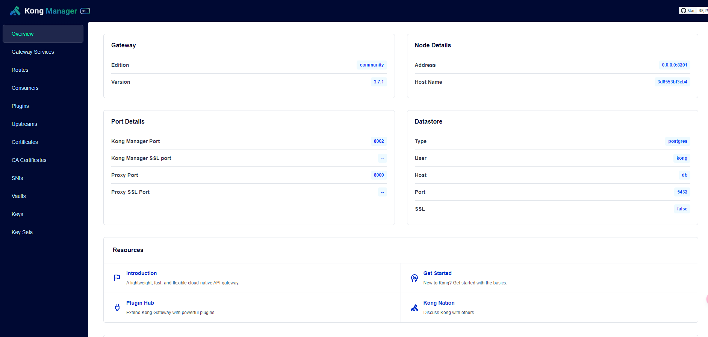
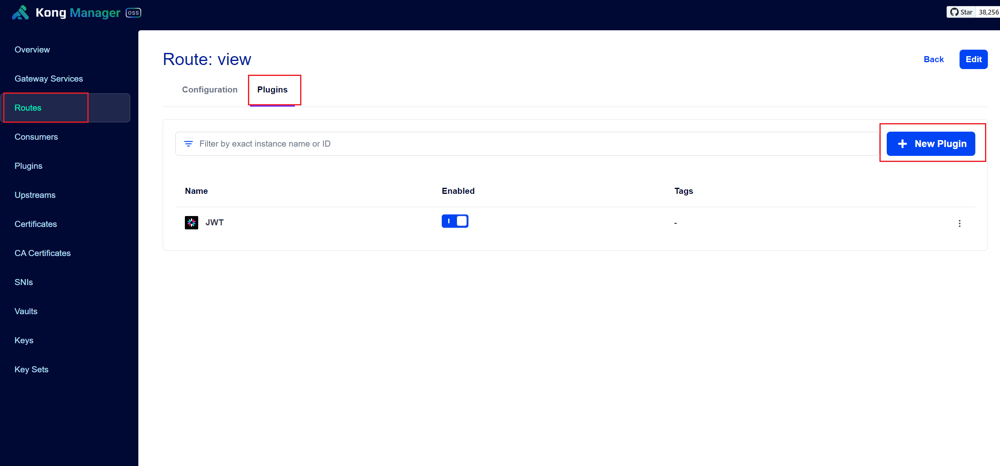
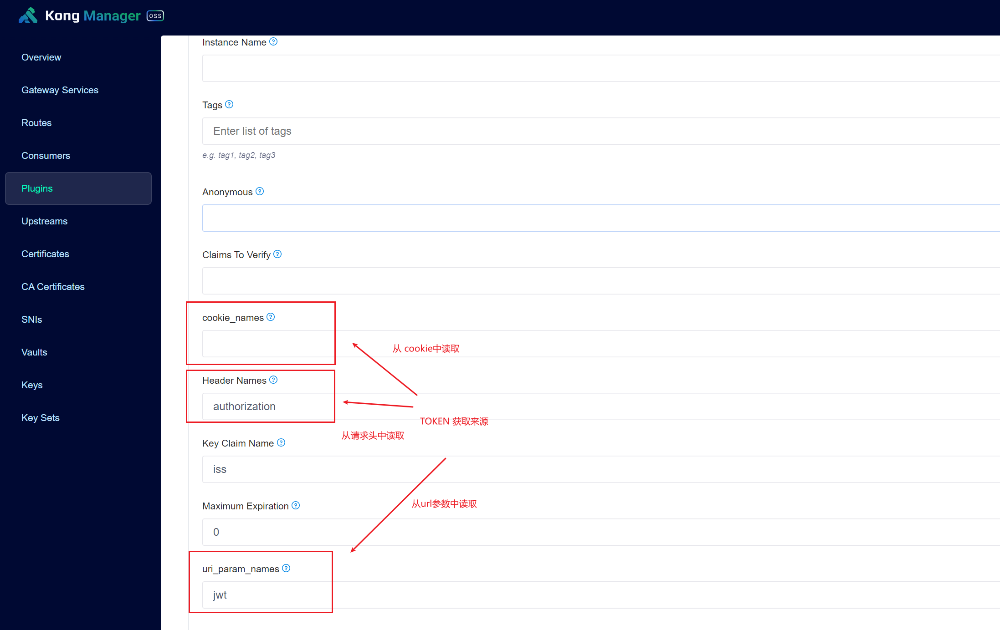
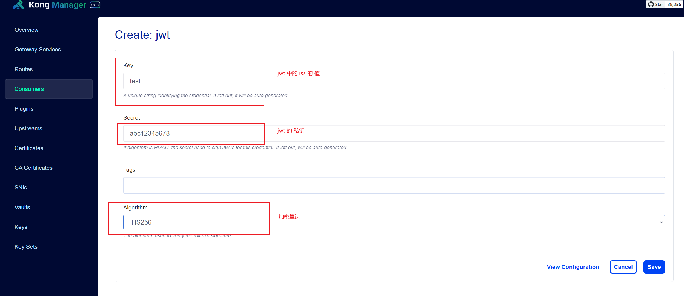

## Kong

### Kong Docker 启动

参见：(https://github.com/Kong/docker-kong/tree/master/compose)

版本：3.7.1

### kong 管理UI

konga github 不再维护。

Kong 官方提供了 kong manager， oss 为开源版本，免费使用，界面操作习惯上与konga差不多。

官方源码地址：https://github.com/Kong/kong-manager.git

启动后，默认端口：8002

### 配置介绍

大致几个步骤：

1. 添加 网关服务 Gateway Service

2. 添加 路由  Routes

3. 添加 Upstream

    - 添加配置
    - 添加目标（Target）

### Nginx代理

在nginx的80或443端口代理到Kong的8000端口到网关上。

做完为这些，就可以在 浏览器中访问 nginx 80 端口，如果有域名通过域名访问。

如果配置一切正确话，是可以正常访问到打开访问页面。

### jwt插件的配置

给路由添加 jwt 插件

1. 选择`Routes`菜单, 在`Configurations`旁边找到`Plugins`，点击`+ New Plugin`按钮

2. 添加页面，找到`jwt`并添加，配置jwt token来源读取方式

3. 选择`Consumers`菜单，新建消费者，`Username`、`Custom id` 可任意填写

4. 点击其中的`consumer`,进入详情页，点击进入`Credentials`标签页面，添加你的应用访问`JWT`私钥信息

到这里基本结束了！

### 可能出现的问题：

> 问题1：浏览器如下提示

    {"message":"Unauthorized"}

原因：出现这个提示，恰恰说明`jwt`插件是正常工作了，但kong没有取到token。

解决办法：检查`jwt插件的配置`的第2步，

- 1). 可能是没有配置正确token的读取来源
- 2). 还有可能是你的`应用`没有正确传递token，需要检查 cookie、header或 url参数

> 问题2：浏览器出现如下提示：

    {"message":"No credentials found for given 'iss'"}

原因：出现这个问题，`Consumers`中的`Credentials`没有配置正确

解决办法：核对`Consumers`中的`Credentials`没有配置

- 1). jwt 的 iss 值是否正确，当然`iss`本身不一定是`iss`，可能是你的业务进行其他的命名
- 2). jwt 的 私钥是否正确
- 3). 加密算法是否正确

