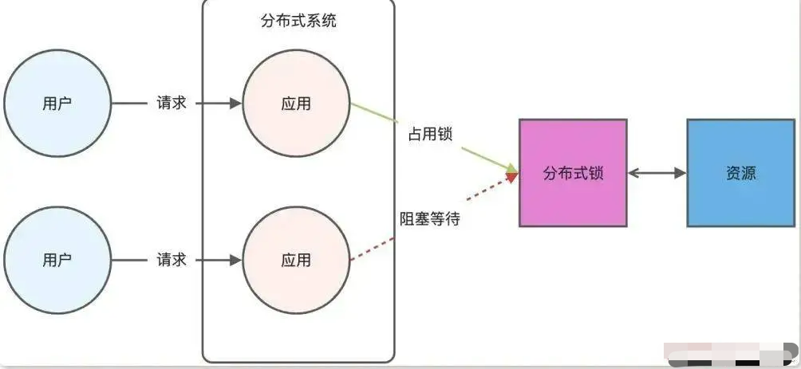
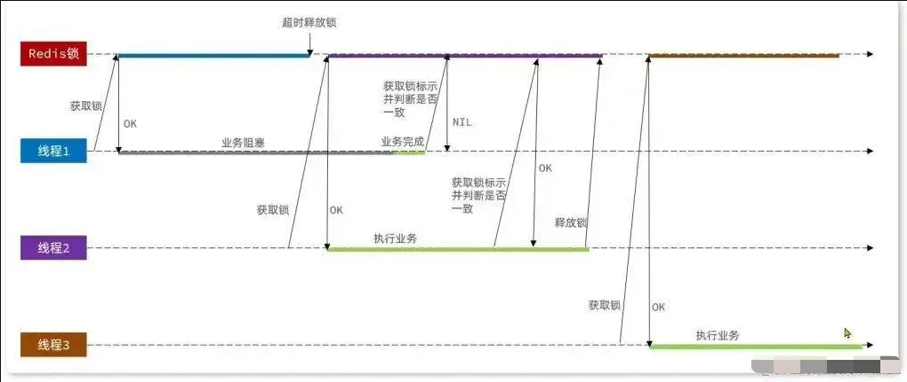
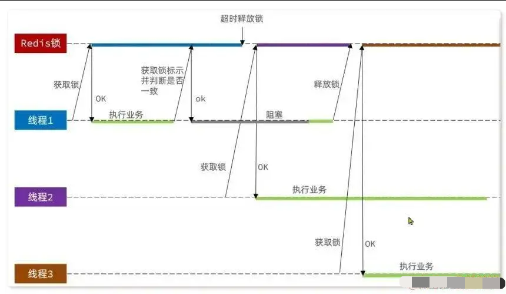
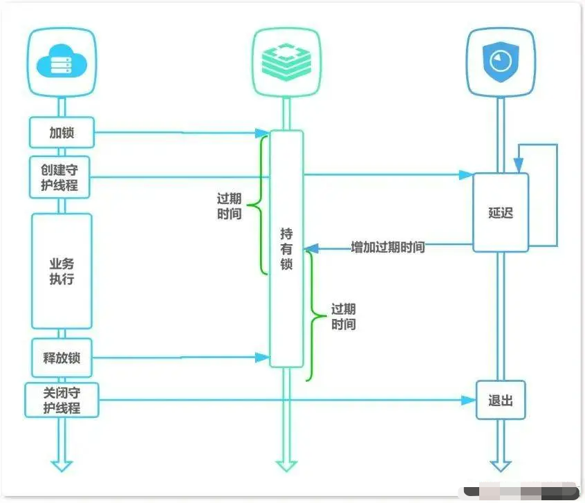

# 如何实现一个合格的分布式锁

*【转载】（https://mp.weixin.qq.com/s/UBo9Ya-ToOAiMtjit5SIxw）*

- 1.概述
- 2.Redis粗糙实现
- 3.解决遗留问题
- 4.Redis实现优缺
- 5.集群问题
- 6.RedLock
- 7.Redisson

## 1 概述

在多线程的环境下，为了保证一个代码块在同一时间只能由一个线程访问，Java中我们一般可以使用 synchronized 语法和 ReentrantLock 去保证，这实际上是本地锁的方式。而在如今分布式架构的热潮下，如何保证不同节点的线程同步执行呢？

实际上，对于分布式场景，我们可以使用分布式锁，分布式锁是用于分布式环境下并发控制的一种机制，用于控制某个资源在同一时刻只能被一个应用所使用。



分布式锁的特点:

- 「互斥性：」 同一时刻只能有一个线程持有锁。
- 「可重入性：」 同一节点上的同一个线程如果获取了锁之后能够再次获取锁。
- 「锁超时：」 类似于J.U.C中的锁，支持锁超时，以防止死锁。
- 「高性能和高可用：」 加锁和解锁需要高效，并且需要保证高可用性，防止分布式锁失效。
- 「具备阻塞和非阻塞性：」 能够及时从阻塞状态中被唤醒。

基于 Spring Boot + MyBatis Plus + Vue & Element 实现的后台管理系统 + 用户小程序，支持 RBAC 动态权限、多租户、数据权限、工作流、三方登录、支付、短信、商城等功能


## 2 Redis粗糙实现

Redis本身可以被多个客户端共享访问，是一个共享存储系统，适合用来保存分布式锁。由于Redis的读写性能高，可以应对高并发的锁操作场景。

Redis的SET命令有一个NX参数，可以实现「key不存在才插入」，因此可以用它来实现分布式锁：

- 如果key不存在，则表示插入成功，可以用来表示加锁成功；
- 如果key存在，则表示插入失败，可以用来表示加锁失败；
- 当需要解锁时，只需删除对应的key即可解锁成功；
- 为了避免死锁，需要设置合适的过期时间。

这样描述，我们可以得到一个十分粗糙的分布式锁实现。

```java
    // 尝试获得锁 
    if (setnx(key, 1) == 1){  
        // 获得锁成功，设置过期时间   
        expire(key, 30) 
        try {        
            //TODO 业务逻辑 

        } finally {        
            // 解锁       
            del(key)  
        }
    }
```

然而，上述实现方式存在一些问题，使其不能被称为合格的分布式锁：

- 「非原子性操作：」 多条命令的操作不是原子性的，可能会导致死锁的产生。
- 「锁误解除：」 存在锁误解除的可能性，即在持有锁的线程在内部出现阻塞时，锁的TTL到期导致自动释放，而其他线程误解除锁的情况。
- 「业务超时自动解锁导致并发问题：」 由于业务超时自动解锁，可能导致并发问题的发生。
- 「分布式锁不可重入：」 实现的分布式锁不支持重入。


## 3 解决遗留问题

### 3.1 误删情况

在以下情况下可能会出现误删情况：

- 持有锁的线程1在锁的内部出现了阻塞，导致其锁的TTL到期从而锁自动释放；
- 此时线程2尝试获取锁，由于线程1已经释放了锁，线程2可以拿到；
- 但是随后线程1解除阻塞，继续执行并开始释放锁；
- 此时可能会将属于线程2的锁释放，导致误删别人锁的情况。

为了解决这个问题，需要在释放锁的时候确保只有持有锁的线程才能释放对应的锁，可以通过在锁中添加标识来实现。



### 3.2 解决方案

对应的解决方案也很简单，既然是一个线程误删了别人的锁，就相当于把别人的厕所门给误开了，那么在开门之前校验一下这扇门是不是自己关上的不就好了：

在存入锁的时候，放入自己的线程标识；

在删除锁的时候，判断当前这把锁是不是自己存入的：

- 如果是，则进行删除；
- 如果不是，则不进行删除。

这样就可以确保只有持有锁的线程才能释放对应的锁，有效地避免了误删别人锁的情况。

```java
    // 尝试获得锁
    if (setnx(key, "当前线程号") == 1) {    
        // 获得锁成功，设置过期时间    
        expire(key, 30);    
        try {        
            // TODO 业务逻辑    
        } finally {        
            // 解锁        
            if ("当前线程号".equals(get(key))) {        
                del(key);        
            }    
        }
    }
```

同时，这种方式也能够将分布式锁改造成可重入的分布式锁，在获取锁的时候判断一下是否是当前线程获取的锁，锁标识自增便可。

### 3.3 原子性保证

前面说到，SETNX和EXPIRE操作是非原子性的。如果SETNX成功，还未设置锁超时时间时，由于服务器挂掉、重启或网络问题等原因，导致EXPIRE命令没有执行，锁没有设置超时时间就有可能会导致死锁产生。

同时，对于上面解决的误删问题，如果以下极端情况同样会出现并发问题：

- 假设线程1已经获取了锁，在判断标识一致之后，准备释放锁的时候，又出现了阻塞（例如JVM垃圾回收机制）；
- 于是锁的TTL到期了，自动释放了；
- 现在线程2趁虚而入，拿到了一把锁；
- 但是线程1的逻辑还没执行完，那么线程1就会执行删除锁的逻辑；
- 但是在阻塞前线程1已经判断了标识一致，所以现在线程1把线程2的锁给误删了；
- 这就相当于判断标识那行代码没有起到作用；
- 因为线程1的获取锁、判断标识、删除锁，不是原子操作，所以我们要防止刚刚的情况。



对于Redis中并没有对应的原子性API提供给我们进行调用，但是我们可以通过Lua脚本对Redis 功能进行拓展。
```lua
    -- 过期时间设置
    if (redis.call('setnx', KEYS[1], ARGV[1]) < 1) then   
        return 0;
    end;
    redis.call('expire', KEYS[1], tonumber(ARGV[2]));

    return 1;

    -- 删除锁
    -- 比较锁中的线程标识与线程标识是否一致
    if (redis.call('get', KEYS[1]) == ARGV[1]) then    
        -- 一致则释放锁    
        return redis.call('del', KEYS[1]) 
    end; 
    return 0
```

以上就是原子性保证的lua脚本实现，通过Java调用 call 方法执行lua脚本即可通过lua脚本 实现原子性操作从而解决该问题。

### 3.4 超时自动解锁

虽然上面解决了误删和原子性问题，但是如果获取锁的线程阻塞时间超过了设置的TTL，那么该自动解锁还是得自动解锁。

对于这种情况，一个简单粗暴的方法就是把过期时间设置得很长，在设置的TTL内，能够保证逻辑一定能够执行完。但是这种方式和不设置TTL一样，如果发生意外宕机之类的情况，下一个线程将会阻塞很长时间，十分不优雅。

因此，针对这个问题，我们可以给线程单独开一个守护线程，去检测当前线程运行情况。如果TTL即将到期，由守护线程对TTL进行续期，保证当前线程能够正确地执行完业务逻辑。



### 3.5 总结

综上所述，基于 Redis 节点实现分布式锁时，我们至少需要实现以下需求：

- 加锁/解锁包括了读取锁变量、检查锁变量值和设置锁变量值三个操作，但需要以原子操作的方式完成；
- 锁变量需要设置过期时间，以免客户端拿到锁后发生异常，导致锁一直无法释放出现死锁，所以，我们在 SET 命令执行时加上 EX/PX 选项，设置其过期时间；
- 锁变量的值需要能区分来自不同客户端的加锁操作，以免在释放锁时，出现误释放操作，所以，我们使用 SET 命令设置锁变量值时，每个客户端设置的值是一个唯一值，用于标识客户端。

## 4 Redis实现优缺

基于 Redis 实现分布式锁的优点：

- 「性能高效：」 这是选择缓存实现分布式锁最核心的出发点。
- 「实现方便：」 很多研发工程师选择使用 Redis 来实现分布式锁，很大成分上是因为 Redis 提供了 setnx 方法，实现分布式锁很方便。
- 「避免单点故障：」 因为 Redis 是跨集群部署的，自然就避免了单点故障。
- 「基于 Redis 实现分布式锁的缺点：」

- 「超时时间不好设置：」 如果锁的超时时间设置过长，会影响性能，如果设置的超时时间过短会保护不到共享资源。对于这种情况可以使用前面提及到的守护线程进行续期操作使得锁得过期时间得到保障。
- 「Redis 主从复制模式中的数据是异步复制的，」 这样导致分布式锁的不可靠性。如果在 Redis 主节点获取到锁后，在没有同步到其他节点时，Redis 主节点宕机了，此时新的 Redis 主节点依然可以获取锁，所以多个应用服务就可以同时获取到锁。

## 5 集群问题

### 5.1 主从集群

为了保证 Redis 的可用性，一般采用主从方式部署。主从数据同步有异步和同步两种方式， Redis 将指令记录在本地内存 buffer 中，然后异步将 buffer 中的指令同步到从节点，从节点一边执行同步的指令流来达到和主节点一致的状态，一边向主节点反馈同步情况。如果这个 master 节点由于某些原因发生了主从切换，那么就会出现锁丢失的情况：

- 在 Redis 的 master 节点上拿到了锁；
- 但是这个加锁的 key 还没有同步到 slave 节点；
- master 故障，发生故障转移，slave 节点升级为 master 节点；
- 导致锁丢失。

### 5.2 集群脑裂

集群脑裂指因为网络问题，导致 Redis master 节点跟 slave 节点和 sentinel 集群处于不同的网络分区，因为 sentinel 集群无法感知到 master 的存在，所以将 slave 节点提升为 master 节点，此时存在两个不同的 master 节点。Redis Cluster 集群部署方式同理。

总结来说脑裂就是由于网络问题，集群节点之间失去联系。主从数据不同步；重新平衡选举，产生两个主服务。等网络恢复，旧主节点会降级为从节点，再与新主节点进行同步复制的时候，由于从节点会清空自己的缓冲区，所以导致之前客户端写入的数据丢失了

当不同的客户端连接不同的 master 节点时，两个客户端可以同时拥有同一把锁

## 6 RedLock

为了保证集群环境下分布式锁的可靠性，Redis 官方已经设计了一个分布式锁算法 Redlock（红锁）。它是基于多个 Redis 节点的分布式锁，即使有节点发生了故障，锁变量仍然是存在的，客户端还是可以完成锁操作。官方推荐是至少部署 5 个 Redis 节点，而且都是主节点，它们之间没有任何关系，都是一个个孤立的节点。

Redlock 算法的基本思路，是让客户端和多个独立的 Redis 节点依次请求申请加锁，如果客户端能够和半数以上的节点成功地完成加锁操作，那么我们就认为，客户端成功地获得分布式锁，否则加锁失败。

这样一来，即使有某个 Redis 节点发生故障，因为锁的数据在其他节点上也有保存，所以客户端仍然可以正常地进行锁操作，锁的数据也不会丢失。

为了取到锁，客户端应该执行以下操作:

- 获取当前Unix时间，以毫秒为单位。
- 依次尝试从5个实例，使用相同的key和具有唯一性的value（例如UUID）获取锁。当向 Redis请求获取锁时，客户端应该设置一个网络连接和响应超时时间，这个超时时间应该小于锁的失效时间。例如你的锁自动失效时间为10秒，则超时时间应该在5-50毫秒之间。这样可以避免服务器端Redis已经挂掉的情况下，客户端还在死死地等待响应结果。如果服务器端没有在规定时间内响应，客户端应该尽快尝试去另外一个Redis实例请求获取锁。
- 客户端使用当前时间减去开始获取锁时间（步骤1记录的时间）就得到获取锁使用的时间。
- 当且仅当从大多数（ N/2+1 ，这里是3个节点）的Redis节点都取到锁，并且使用的时间小于锁失效时间时，锁才算获取成功。
- 如果取到了锁，key的真正有效时间等于有效时间减去获取锁所使用的时间（步骤3计算的结果）。
- 如果因为某些原因，获取锁失败（没有在至少 N/2+1 个Redis实例取到锁或者取锁时间已经超过了有效时间），客户端应该在所有的Redis实例上进行解锁，这是因为即便某些Redis实例根本就没有加锁成功，防止某些节点获取到锁但是客户端没有得到响应而导致接下来的一段时间不能被重新获取锁。可以看到，加锁成功要同时满足两个条件：
    
    客户端从超过半数（大于等于 N/2+1 ）的 Redis 节点上成功获取到了锁；
    
    客户端从大多数节点获取锁的总耗时（ t2-t1 ）小于锁设置的过期时间。

简单来说就是：如果有超过半数的 Redis 节点成功的获取到了锁，并且总耗时没有超过锁 的有效时间，那么就是加锁成功。

## 7 Redisson

### 7.1 简单实现

Redisson 是 Redis 的 Java 客户端之一，提供了丰富的功能和高级抽象，包括分布式锁、分布式集合、分布式对象等。因此我们能够很简单的通过 Redisson 实现分布式锁，而不用自己造轮子。

与此同时，Redisson 是支持原子性加/解锁、锁重试、可重入锁、RedLock 等功能的，感兴趣的话可以自行了解。

```java
    // 获取分布式锁
    RLock lock = redissonClient.getLock("myLock");
    try {
        // 尝试加锁，最多等待 10 秒，加锁后的锁有效期为 30 秒
        boolean locked = lock.tryLock(10, 30, TimeUnit.SECONDS);
        if (locked) {
            // 成功获取锁，执行业务逻辑
            System.out.println("获取锁成功，执行业务逻辑...");
    } else {
            // 获取锁失败，可能是超时等待或者其他原因
            System.out.println("获取锁失败...");
    }
    } catch (InterruptedException e) {
        e.printStackTrace();
    } finally {
        // 释放锁
        lock.unlock();
        // 关闭 Redisson 客户端
        redissonClient.shutdown();
    }
```
对了这里提一嘴，Redisson存储分布式锁是通过Hash结构进行存储的，内置的键值对是< 线程标识,重入次数>，其中重入次数便可用于实现可重入机制。

### 7.2 看门狗机制

在 Redisson 中，「看门狗机制（Watchdog）」 是用于维持 Redis 键的过期时间的一种机制。

通常情况下，当我们给 Redis 中的键设置过期时间后，Redis 会自动管理键的生命周期，并在键过期时通过过期删除策略对其进行处理。然而，如果 Redis 进程崩溃或者网络故障导致 Redis 服务器与客户端连接中断，那么键的过期时间可能无法得到及时删除，从而导致键仍然存在于 Redis 中。

为了解决这个问题，Redisson 引入了看门狗机制。当 Redisson 客户端为一个键设置过期时 间时，它会启动一个看门狗线程，该线程会监视键的过期时间，并在过期时间快到期时自动对键进行 续期操作。这样，即使因为 Redis 进程崩溃或者网络故障导致连接中断，看门狗仍然可以继续维护 键的过期时间。

看门狗机制的工作原理如下：

- 当客户端获取分布式锁时，Redisson 会在 Redis 服务器中创建一个对应的键值对，并给这个键值对设置一个过期时间（通常是锁的持有时间）；
- 同时，Redisson 会启动一个看门狗线程，在分布式锁的有效期内定时续期锁的过期时间；
- 看门狗线程会周期性地检查客户端是否还持有锁，如果持有锁，则会为锁的键值对设置新的过期时间，从而延长锁的有效期；
- 如果客户端在锁的有效期内未能续期，即看门狗线程无法找到对应的锁键值对，那么锁会自动过期，其他客户端就可以获取这个锁。
- 在Redisson中，默认续约时间是30s(可配置)，即每隔30s续约一次，延长30s。

设置较短的续约时间可以更快地释放锁，但可能会增加续约的频率；较长的续约时间可以减 少续约的次数，但会使得锁的有效期更长。

看门狗机制的好处是保证了在获取分布式锁后，业务逻辑可以在锁的有效期内运行，不会因为锁 的过期而导致锁失效。当业务逻辑执行时间超过锁的过期时间时，看门狗线程会自动延长锁的过期时 间，从而避免了锁的自动释放。

需要注意的是，看门狗线程是后台线程(守护线程)，不会影响到客户端的正常业务逻辑。同时， 为了避免看门狗线程过多占用 Redis 的 CPU 资源，Redisson 会动态调整看门狗的检查周期，使 得看门狗线程在不影响性能的情况下维持锁的有效性

